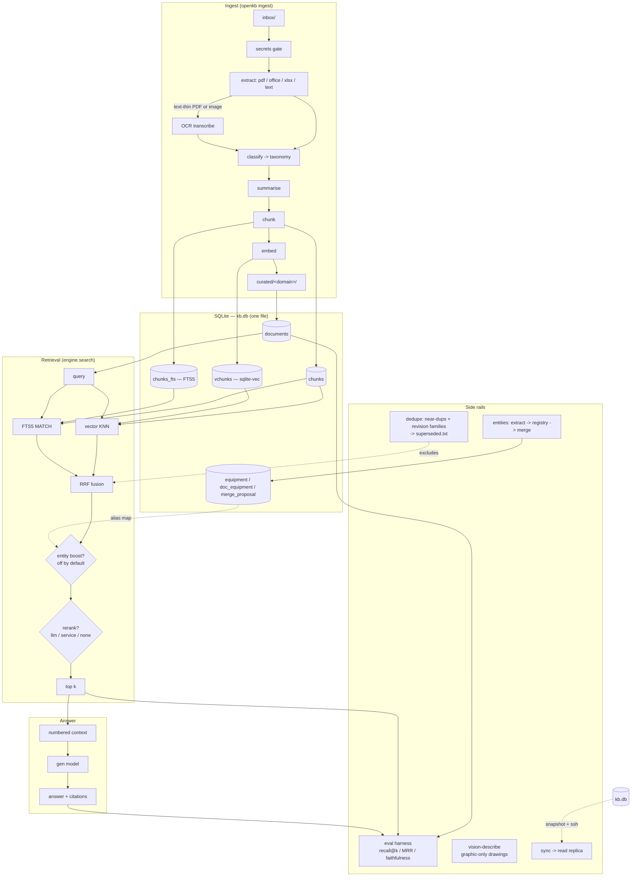

# Architecture

open-kb is a small number of stdlib-and-SQLite modules wired together in a
straight line: documents go in through ingest, everything lands in one
SQLite file, retrieval reads that file and fuses two search strategies, and
an LLM turns the fused result into a cited answer. Two side rails — an eval
harness and a maintenance toolkit — exist to keep the whole thing honest
over time.

## Component diagram

## Ingest pipeline

For every file dropped into `paths.inbox`: dedupe by SHA-256 → secrets gate
(filename, then content) → extract text (format-specific; PDFs get an OCR
fallback when the text layer is thin) → classify into exactly one taxonomy
bucket via the general LLM → summarise → chunk on paragraph boundaries →
embed each chunk → commit document + chunks + vectors + FTS rows in a single
transaction → move the original into `curated/<domain>/` → append one line
to `curated/_MANIFEST.jsonl`.

The manifest is the resumability ledger: a file already recorded there (with
a terminal action) is never reprocessed, and a file that keeps failing is
retried up to a small cap before being logged as a permanent skip — so one
persistently broken document can't stall the rest of an inbox. Full detail
in `src/openkb/ingest/worker.py`'s module docstring.

## Storage: why SQLite + sqlite-vec

- **Single file.** The entire knowledge base — documents, chunk text,
  embeddings, the FTS index, the equipment registry — lives in one `.db`
  file. Backup is `cp`. A read replica is a file copy shipped over SSH, not
  a second service to stand up and keep in sync.
- **No server.** `sqlite-vec` loads as a SQLite extension inside the same
  process that's already talking to the database — there's no separate
  vector-database daemon to run, monitor, or upgrade independently.
- **Replica = copy.** Because the entire retrieval surface (vectors, FTS
  index, registry) is inside the one file, promoting a new version to a
  serving host is exactly "copy this file into place," with no schema
  migration step and no reindex step on the far end. See `sync.py`.

## Why the FTS5 arm matters

Vector search is good at *meaning* — synonyms, paraphrase, "what pump
handles cooling water" finding a chunk that never says "cooling water"
verbatim. It is comparatively bad at *exact strings*: a part number, a tag
like `DG1`, an error code. An embedding model tends to treat those as noise
tokens and blur them into a nearby-but-wrong match. FTS5's BM25-style
lexical ranking treats them as exactly what they are — an exact term to
find — so the two arms cover each other's blind spot. A query for a specific
tag or part number is exactly the case where dropping the FTS5 arm would
quietly regress recall on the questions that matter most in a technical
corpus.

## Why reciprocal-rank fusion (RRF)

Vector distance and BM25 score are not on a comparable scale — one is a
cosine/L2-style distance, the other a term-frequency-weighted lexical
score — so trying to normalise and blend the two numeric scores directly
means inventing a conversion factor with no principled basis. RRF sidesteps
that: it only looks at each arm's *rank order* and sums `1 / (rrf_k + rank)`
across arms. No score normalisation, one tunable constant (`rrf_k`), and
it's a well-established strong baseline precisely because it never has to
answer "is a vector-distance of 0.3 better or worse than a BM25 score of
12.7."

## Why listwise LLM rerank (and why a cross-encoder is wired in too)

RRF gives a decent first cut but fuses two rankers that know nothing about
each other's notion of relevance, or about the actual content of the
candidate text. A reranker reads the text. `rerank.py` implements two
backends:

- **`llm`** (default): number the fused candidates, ask an instruct model to
  return the full permutation best-first as a JSON array, apply it. Works
  with any chat-capable local model, no extra service. Slower (one
  generation call per query) but, on this project's own canonical eval, the
  strongest option by a clear margin — see
  [`docs/lessons-learned.md`](lessons-learned.md).
- **`service`**: a small HTTP microservice running a cross-encoder (e.g.
  `sentence-transformers` `CrossEncoder`). Much faster, but measured *worse
  than no rerank at all* on the technical/tabular corpus this project was
  evaluated against. It stays wired in — as the local-model landscape moves,
  a future cross-encoder might well win — but it is not the default for a
  reason backed by a measurement, not a guess.

Either backend is fail-open: any exception (model down, malformed response,
timeout) degrades silently to the pre-rerank fused order. A broken reranker
should make answers slightly less good, never take retrieval down.

## Why registry-boost instead of query expansion

A common alternative to a plain hybrid search is *query expansion* —
rewriting or augmenting the query with synonyms, related terms, or resolved
aliases before it's ever searched. open-kb deliberately does not do this.
Expansion tends to inject noise terms that can hurt the lexical (FTS5) arm's
precision — a query padded with plausible-sounding related words often
matches more chunks, just not more of the *right* chunks.

Instead, the optional entity boost (`retrieval.entity_boost`, off by
default) never touches the query text. It looks for an equipment alias from
the registry that appears literally in the query, and gives a small additive
nudge to chunks belonging to that alias's linked documents — after RRF fusion
has already happened. It can only re-order what hybrid retrieval already
found; it can never cause a chunk to appear that wasn't already in the fused
pool. That containment is what makes it safe to leave off by default and
only enable after it earns its keep on your own eval set.

## Why superseded.txt exclusion instead of deletion

Technical document trees accumulate revisions — `v1`, `v2`, `-final`,
`-final-FINAL`. All of them get ingested (ingest should never silently drop
a document someone dropped in the inbox), but retrieval should prefer the
current one. `dedupe.py`'s revision-family detector proposes which documents
to hide; `supersede()` appends their `rel_path` to a plain text file,
`superseded.txt`, next to `kb.db`. The retrieval engine loads that file
(mtime-cached) and excludes any listed path from results.

This is deliberately reversible: deleting a line restores the document to
search immediately, with no re-ingest and no risk of having actually lost
the row. It is also auditable — a grep of `superseded.txt` answers "why
isn't this document showing up?" in one command, with a reason recorded
alongside each entry.

## Why proposals-only equipment merges

The equipment/entity registry is built in three phases, each with a
different trust level:

1. **Extract** (`entities/extract.py`) — a raw, per-document LLM opinion
   about what equipment/systems a document describes. Written verbatim to
   `doc_entities`; never cross-referenced against anything yet.
2. **Registry** (`entities/registry.py`) — rebuilds the canonical
   `equipment` table using *only* exact-match keys it can verify itself
   (identical make+model, or an identical tag matching a generic tag
   grammar). No LLM judgement is trusted here — this phase is deterministic
   and idempotent.
3. **Merge** (`entities/merge.py`) — registry rows that are probably the
   same physical item under two labels (a location tag in one document, a
   make+model in another) are found by document co-occurrence, then
   adjudicated by an LLM call that defaults to "not the same" whenever it is
   unsure or its output fails to parse. Nothing is merged automatically —
   `propose_merges` only ever writes a proposal row; `apply_merges` is a
   separate, explicit step that acts only on proposals above a confidence
   threshold or hand-approved by an operator.

A missed merge costs one extra registry row. A wrong merge silently blends
two pieces of equipment's document history into one — much worse, and much
harder to notice. Splitting the pipeline this way means a bad call in phase
1 can never corrupt the registry on its own; every merge traces back to an
inspectable proposal.

## Side rails

- **Eval harness** (`evaluate.py`) — a fixed, hand-authored gold-question
  set scores retrieval (recall@k, MRR) and, optionally, generated-answer
  faithfulness and gold-substring correctness. This is the only thing that
  gets to say whether a retrieval lever is worth keeping.
- **Dedupe / supersede** (`dedupe.py`) — near-duplicate content detection
  (MinHash/LSH over chunk text, no embedding model required) and revision-
  family detection (filename-pattern grouping), both read-only by default,
  both acting only through the `superseded.txt` exclusion list.
- **Replica sync** (`sync.py`) — snapshots the live (possibly WAL-mode)
  database via SQLite's backup API, flattens it to a single self-contained
  file, ships it over SSH, and atomically swaps it into place on a serving
  host. Change-gated (a sentinel file skips the whole operation when
  nothing changed) and lock-guarded (a stale lock older than an hour is
  assumed abandoned and stolen). See [`docs/deployment.md`](deployment.md).
